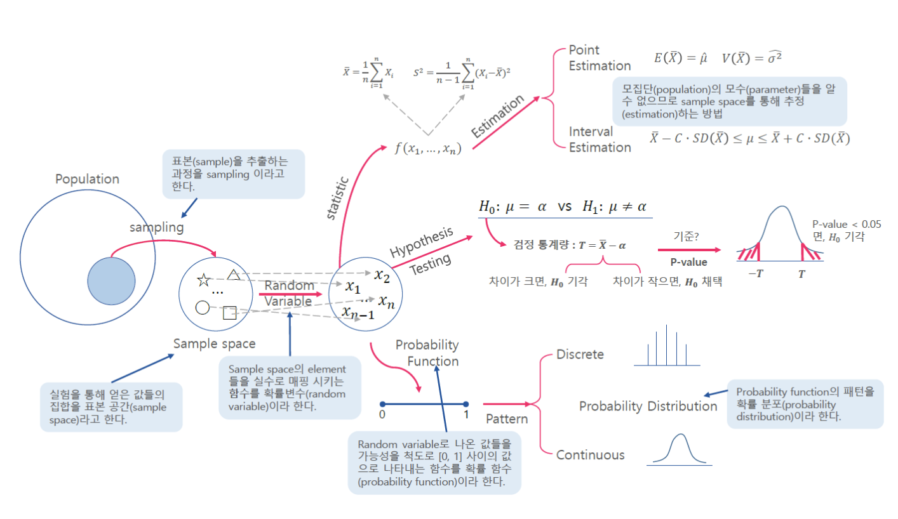
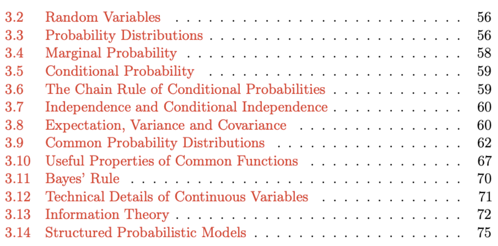
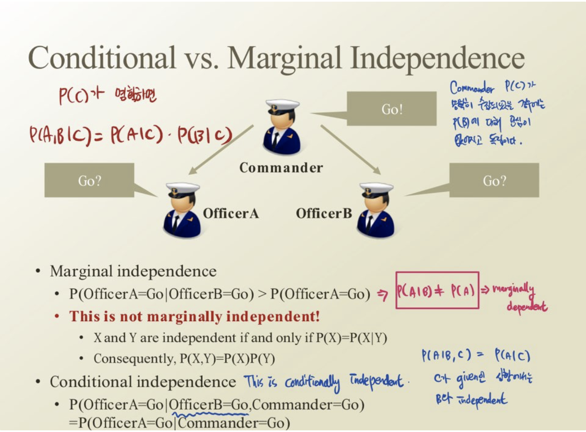
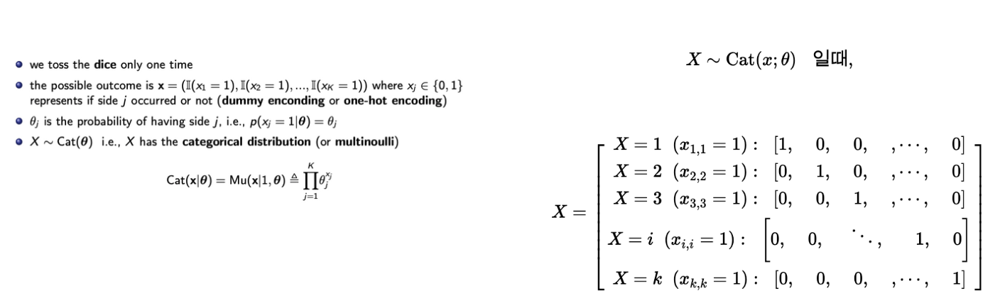
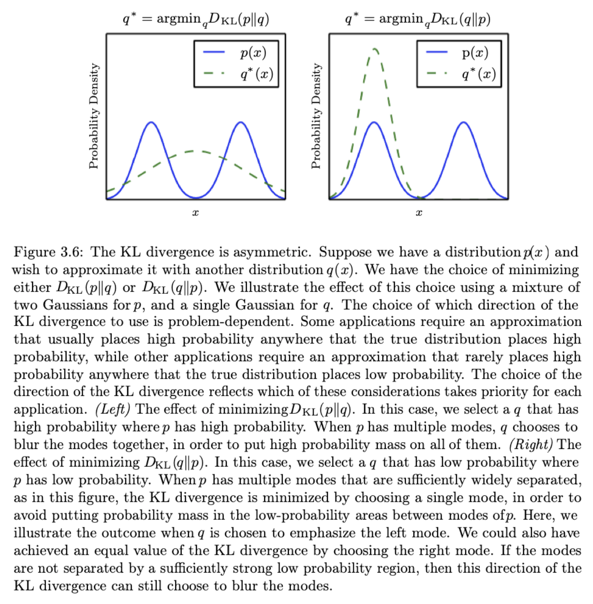
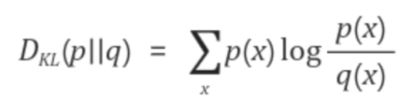
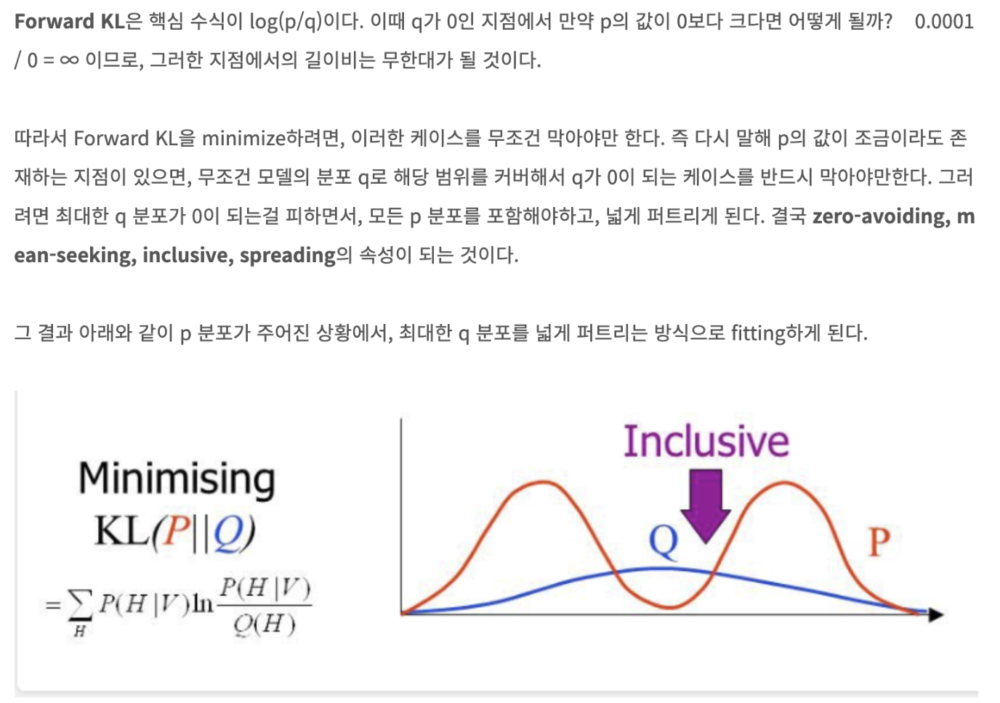
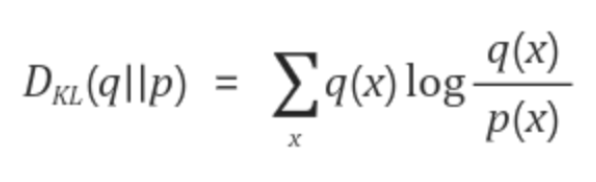
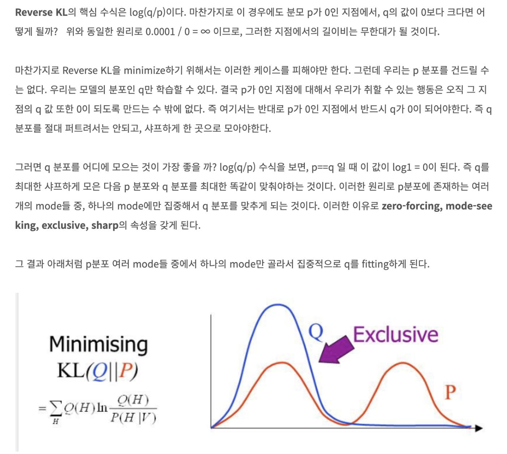

##### 진행자 :  [윤훈상](https://github.com/Hoonst).

## 참고 자료

# ISSUE

목차:

## 

### 1) Bayesian as Frequentist?

베이지안 확률을 빈도적 확률로 간주해야 한다는 말이 있었다.

이에 대하여, MAP와 같은 베이지안 확률 업데이트에서 사전확률에 사후확률이라는 빈도 확률을 얹어가면서 계산하는 자체가 베이지안을 빈도적 관점으로 바라보고 있음을 시사한다고 결론 내렸다.

또는 '베이지안' 자체가 기본적으로 빈도적 관점보다 불확실하기에 업데이트를 통한 보완

### 2) Conditional Probability

P(German | Speaks German)에 대한 확률은 클 것이다.

하지만 독일인 이외에도 학습을 통해 German을 학습한 사람이 있을 것이고, 이럴 때는 독일어 사용 유무가 독일인이라는 확실함이 없다. 따라서 어떤 요인을 더해야 German 이 될 수 있을까를 연구하는 분야가 'Causal Modeling'이다. 예를 들어, Speaks German 이외에 감자를 많이 먹는다, 유대인한테 미안해한다 등과 같은 다른 요인을 탐색하는 것이다.

### 3) 조건부 독립 사례

사진 출처 : 문일철 교수님 강의 (edwith)

### 4) Bernoulli/ Multinoulli Distribution은 사실 '시행'으로 보는게 나을 것이다.

### 5) Gaussian은 PRML안에 진리가 담겨있다.

### 6) KL-Divergence에 대한 고찰 필요

------

##### [ 😎 유경  Comment 😎 ] 

- P는 항상 고정되어있는것이 맞음 (True probability이기 때문)

- P와 Q가 크게 차이나지 않는 경우 정보가 유의미하지않음 (엔트로피 낮음) / P와 Q 사이에 큰 차이가 있는 경우 정보는 매우 유익함 (엔트로피 높음 → KL Divergence 높음)

- KL Divergence는 교환법칙이 성립하지 않음 (p,q의 위치를 바꾸면 다른값이 도출)

- KL Divergence (Forward KL)

  

  

- Reverse KL Divergence

  

  

🔥출처 !🔥

https://hyunw.kim/blog/2017/10/27/KL_divergence.html

https://adventuresinmachinelearning.com/cross-entropy-kl-divergence/

https://newsight.tistory.com/119

